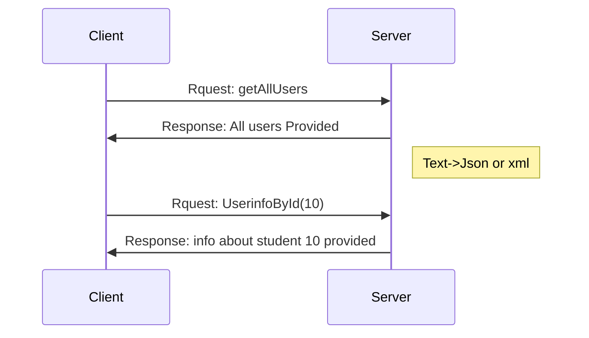

#  Introduction to RESTful API
## first What is Json?
1. **JSON stands for JavaScript Object Notation**:  
   - JSON is derived from JavaScript and is used for structuring data in a readable format. Although it originates from JavaScript, it is now widely used across different programming languages.

2. **JSON is a lightweight data-interchange format**:  
   - JSON is designed to be easy to read and write for humans, as well as easy for machines to parse and generate. Its lightweight nature makes it a popular choice for data exchange over the web.

3. **JSON is used to send data between computers**:  
   - It is commonly used in web APIs for transmitting data between a client (like a web browser) and a server.

4. **JSON is a text format**:  
   - JSON data is represented as plain text, making it easily accessible and compatible with various systems and applications.

5. **Used for storing and transporting data**:  
   - JSON can be used to store data in files or databases and is also utilized for data transmission in network requests (like HTTP requests).

6. **JSON is "self-describing" and easy to understand**:  
   - The structure of JSON is straightforward, using key-value pairs and arrays, which helps convey data meaning intuitively.

7. **JSON is language independent**:  
   - While it originates from JavaScript, JSON can be used with many programming languages, including Python, Ruby, Java, C#, and others, making it a versatile choice for data interchange.

### Example of JSON

Here's a simple example of a JSON object:

```json
{
  "name": "Ayoub",
  "age": 25,
  "isStudent": false,
  "courses": ["JavaScript", "Python", "Django"],
  "address": {
    "street": "123 Main St",
    "city": "Anytown",
    "country": "Country"
  }
}
```
JSON stores data in plain text format. This provides a software and hardware independent way of storing , transporting , and sharing data. 

##  What is API in simple words?
API is the acronym for application programming interface — a software intermediary that allows two applications to talk to each other.


##  What is API in simple words?
API is the acronym for application programming interface — a software intermediary that allows two applications to talk to each other.


## What is Web API 



- A Web API (Application Programming Interface) is a set of protocols and tools for building and interacting with software applications.
- It allows different software systems to communicate with each other over the web.

### key point about web APIs :
 **Interoperability**: Web APIs enable different systems, platforms, and applications to interact and exchange data. This can be between a client application (like a web browser) and a server, or between two servers.
 **HTTP Protocol**: Most Web APIs use the HTTP protocol for communication, which is the same protocol used by the web. This makes them accessible via URLs and allows them to be easily integrated with web technologies.
**RESTful APIs**: One of the most common types of Web APIs is RESTful (Representational State Transfer) APIs. RESTful APIs adhere to a set of principles and use standard HTTP methods like GET, POST, PUT, DELETE, etc., to perform operations on resources.
 **Data Formats**: Web APIs often use JSON (JavaScript Object Notation) or XML (Extensible Markup Language) to format the data being exchanged. JSON is more commonly used due to its simplicity and ease of use with Programming Languages.
**Endpoints**: An API endpoint is a specific URL where an API can access the resources it needs to perform its function. Each endpoint corresponds to a different function of the API.
**Authentication and Authorization**: Web APIs often require authentication (verifying the identity of a user or system) and authorization (checking if the user or system has permission to perform a certain action). Common methods include API keys, OAuth, and tokens.

