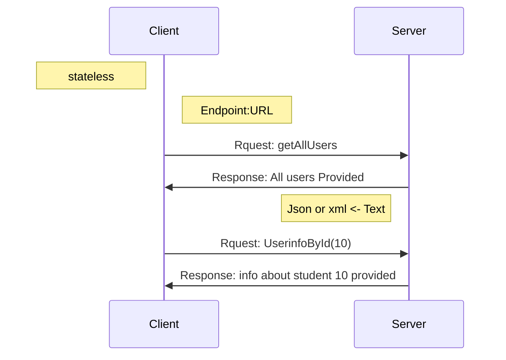

#  Introduction to RESTful API
## first What is Json?
1. **JSON stands for JavaScript Object Notation**:  
   - JSON is derived from JavaScript and is used for structuring data in a readable format. Although it originates from JavaScript, it is now widely used across different programming languages.

2. **JSON is a lightweight data-interchange format**:  
   - JSON is designed to be easy to read and write for humans, as well as easy for machines to parse and generate. Its lightweight nature makes it a popular choice for data exchange over the web.

3. **JSON is used to send data between computers**:  
   - It is commonly used in web APIs for transmitting data between a client (like a web browser) and a server.

4. **JSON is a text format**:  
   - JSON data is represented as plain text, making it easily accessible and compatible with various systems and applications.

5. **Used for storing and transporting data**:  
   - JSON can be used to store data in files or databases and is also utilized for data transmission in network requests (like HTTP requests).

6. **JSON is "self-describing" and easy to understand**:  
   - The structure of JSON is straightforward, using key-value pairs and arrays, which helps convey data meaning intuitively.

7. **JSON is language independent**:  
   - While it originates from JavaScript, JSON can be used with many programming languages, including Python, Ruby, Java, C#, and others, making it a versatile choice for data interchange.

### Example of JSON

Here's a simple example of a JSON object:

```json
{
  "name": "Ayoub",
  "age": 25,
  "isStudent": false,
  "courses": ["JavaScript", "Python", "Django"],
  "address": {
    "street": "123 Main St",
    "city": "Anytown",
    "country": "Country"
  }
}
```
JSON stores data in plain text format. This provides a software and hardware independent way of storing , transporting , and sharing data. 

##  What is API in simple words?
API is the acronym for application programming interface — a software intermediary that allows two applications to talk to each other.


## What is Web API 



- A Web API (Application Programming Interface) is a set of protocols and tools for building and interacting with software applications.
- It allows different software systems to communicate with each other over the web.


Here are some key points about web APIs, summarized for clarity:

### Key Points about Web APIs:

1. **Interoperability**: Web APIs facilitate communication and data exchange between diverse systems, platforms, and applications, enabling seamless integration.

2. **HTTP Protocol**: Most web APIs utilize the HTTP protocol, allowing them to be accessed via URLs and easily integrated with existing web technologies.

3. **RESTful APIs**: A prevalent type of web API, RESTful APIs follow principles of Representational State Transfer, employing standard HTTP methods (GET, POST, PUT, DELETE) to manage resources.

4. **Data Formats**: Web APIs typically exchange data in JSON (JavaScript Object Notation) or XML (Extensible Markup Language), with JSON being favored for its simplicity and compatibility with various programming languages.

5. **Endpoints**: Each API endpoint is a specific URL that enables access to particular resources or functions of the API, making it easy to interact with.

6. **Authentication and Authorization**: Web APIs often implement authentication (verifying identity) and authorization (granting permission) using methods like API keys, OAuth, and tokens to secure access. 

These points encapsulate the essential aspects of web APIs and their functionality.


Here is the text in a format ready for copying without any changes:

---
# Web APIs benefits 
Web APIs offer numerous benefits for software development and system integration. Here are some of the key advantages:

1. **Interoperability**  
   Cross-Platform Compatibility: Web APIs allow different software applications, regardless of platform or technology, to communicate with each other. This enables integration between various systems, including web, mobile, desktop, and server applications.

2. **Reusability**  
   Code Reuse: APIs encapsulate functionality that can be reused across different projects. This reduces the need to write the same code multiple times, saving development time and effort.  
   Service-Oriented Architecture: APIs support the development of modular services that can be reused across different applications and projects.

3. **Scalability**  
   Efficient Scaling: APIs can handle a large number of requests and are designed to scale efficiently. This makes it easier to manage and distribute load across multiple servers and services.  
   Microservices Architecture: APIs enable the creation of microservices, allowing each service to be scaled independently based on demand.

4. **Flexibility**  
   Agile Development: APIs allow for flexible and agile development practices. Developers can work on different parts of an application independently and integrate them using APIs.  
   Extensibility: APIs provide a way to extend the functionality of an application without modifying its core components. This facilitates adding new features and integrations.

5. **Automation**  
   Automated Processes: APIs enable the automation of tasks and processes. For example, APIs can be used to automate data retrieval, data entry, and interaction with third-party services.  
   Continuous Integration and Deployment: APIs support automated testing and deployment pipelines, improving the efficiency and reliability of the development process.

6. **Improved User Experience**  
   Dynamic Content: APIs enable the retrieval and display of dynamic content, improving the responsiveness and interactivity of applications.  
   Seamless Integrations: APIs allow for seamless integration with third-party services, providing users with a richer and more comprehensive experience.

7. **Security**  
   Controlled Access: APIs can enforce authentication and authorization mechanisms to control access to data and services, ensuring that only authorized users can perform certain actions.  
   Data Protection: APIs can be designed to protect sensitive data through encryption, secure communication protocols (like HTTPS), and other security measures.

8. **Standardization**  
   Consistent Interfaces: APIs provide standardized interfaces for interacting with services, making it easier for developers to understand and use them.  
   Documentation: APIs are typically well-documented, providing clear guidelines and examples on how to use them effectively.

9. **Innovation**  
   Faster Development: APIs allow developers to leverage existing services and functionalities, accelerating the development of new applications and features.  
   Ecosystem Growth: APIs foster the creation of ecosystems where developers can build on top of each other's work, driving innovation and collaboration.

10. **Cost Efficiency**  
    Reduced Development Costs: By reusing existing APIs and services, organizations can reduce the costs associated with developing and maintaining custom solutions.  
    Operational Efficiency: APIs streamline processes and reduce the need for manual intervention, leading to cost savings and operational efficiencies.

---
